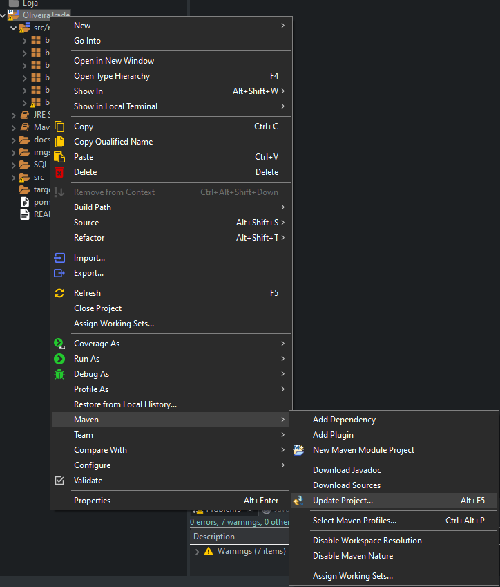
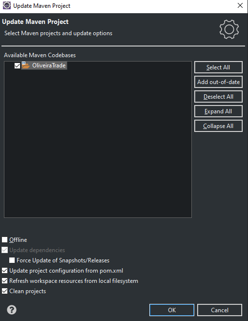
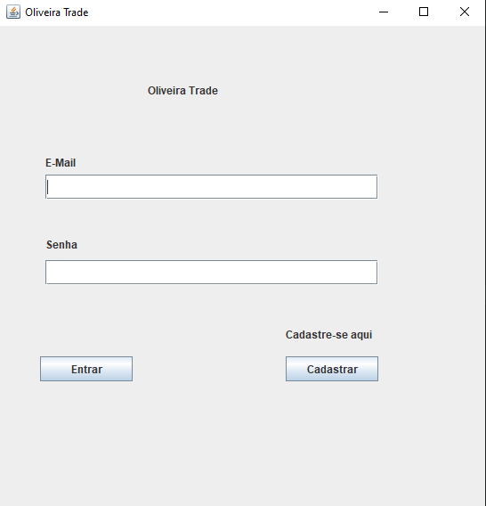
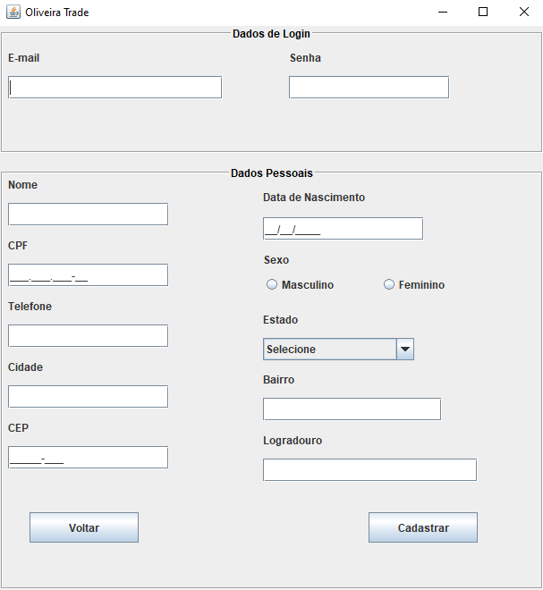
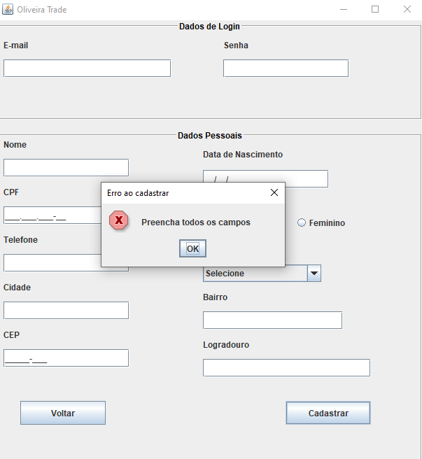

# Teste-Desenvolvedor-Programa
Programa relacionado ao teste do Programa Best Minds 2022 - Pessoa Desenvolvedora Trainee

<h1> ATENÇÃO !!!!</h1>
  <h3>Siga as instruções para que o projeto possa funcionar sem erros.</h3>
  
Ao abrir clique com o botão direito do mouse no projeto -> Maven -> Uptade Project. Após isso clique em OK, na janela que irá abrir

  

    
    

Foi desenvolvido projeto em que, o usuário pode se cadastrar e ter seu cadastro salvo no banco de dados. Também pode realizar o login, com e-mail e senha, para acessar o sistema Oliveira Trade.

<a href="https://bielsunn.github.io/Teste-Desenvolvedor-Programa/">Documentação Javadoc</a>

<h2>Ferramentas utilizadas:</h2>
<ul>
  <li>IDE: <b>Eclipse</b></li>
  <li>Linguagem: <b>Java</b></li>
  <li>SGBD(Sistema de gerenciamento de banco de dados): <b>PostgreSQL</b></li>
  <li>Para criação da interface gráfica do projeto, foi utilizado o plugin <b>WindowBuilder</b> do Eclipse.</li>
</ul>

<h2>Funcionalidades das Classes</h2>
<h3>TelaLogin</h3>

Login para acessar o sistema, o usuário deve informar o e-mail e senha.

Caso o e-mail e senha existam no sistema, será redirecionado para o sistema Oliveira Trade. Caso contrário ou tenha ocorrido algum erro de digitação, será informado uma mensagem de erro.

    
    
    

  

<h3>TelaCadastro</h3>

Para ser feito o cadastro, o usuário deve preencher todos os campos. Após serem preenchidos será retornado que o cadastro foi realizado.

    
    
    

  

<h3>TelaSistema</h3>

Tela principal do Sistema, que só poderá ser acessada após o usuário realizar o login.

    

 

