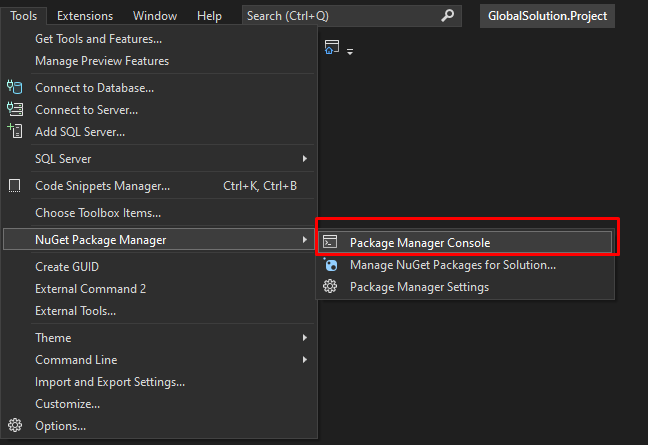
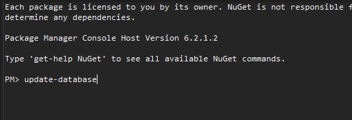
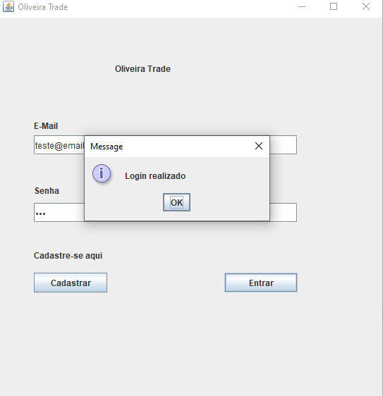
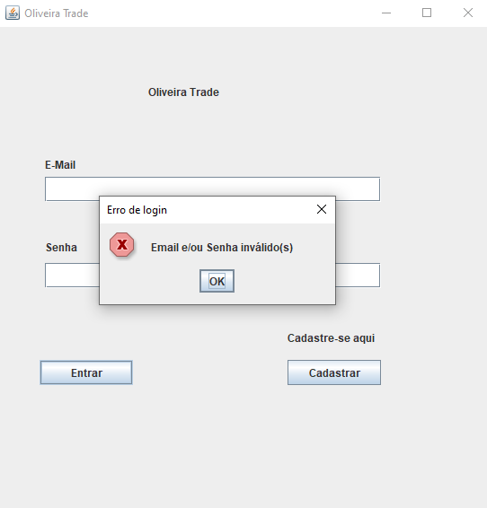
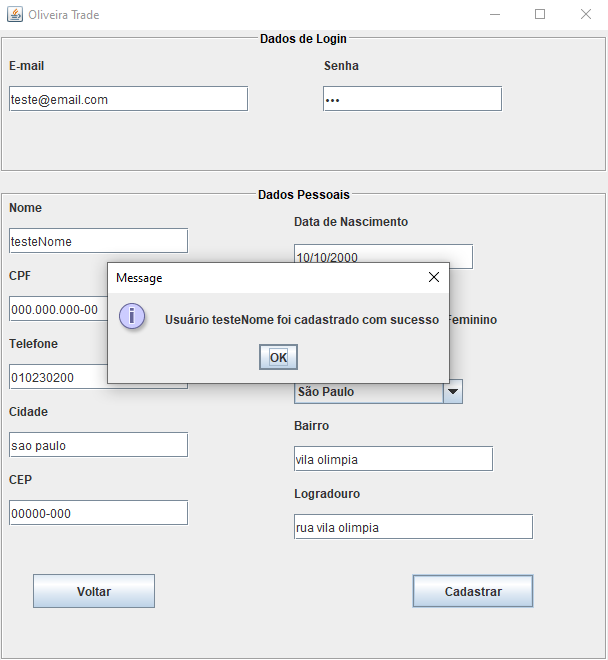

# Teste-Desenvolvedor-Programa
Programa relacionado ao teste do Programa Best Minds 2022 - Pessoa Desenvolvedora Trainee
---------------------------------------------------------------------------------------------------------------------------------------------------- 

# Solução
- Foi desenvolvido projeto em que, o usuário pode se cadastrar e ter seu cadastro salvo no banco de dados. Também pode realizar o login, com e-mail e senha, para acessar o sistema Oliveira Trade.

## Como iniciar
- Ao abrir o Visual Studio ir na aba Tools -> NuGet Package Manager -> Package Manager Console
- Ao abrir o console digitar: "update-database"

---------------------------------------------------------------------------------------------------------------------------------------------------- 

## Ferramentas utilizadas:
- IDE: Visual Studio
- Linguagem: C# com ASP.NET
- Banco de dados: Microsoft SQL Server

---------------------------------------------------------------------------------------------------------------------------------------------------- 

<h2>Funcionalidades das Classes</h2>

<h3>OliveiraTrade</h3>

Classe de Execução do Sistema

<h3>TelaLogin</h3>

Login para acessar o sistema, o usuário deve informar o e-mail e senha.

Caso o e-mail e senha existam no sistema, será redirecionado para o sistema Oliveira Trade. Caso contrário ou tenha ocorrido algum erro de digitação, será informado uma mensagem de erro.

    
    
    

  

<h3>TelaCadastro</h3>

Para ser feito o cadastro, o usuário deve preencher todos os campos. Após serem preenchidos será retornado que o cadastro foi realizado.

    
    
    

  

<h3>TelaSistema</h3>

Tela principal do Sistema, que só poderá ser acessada após o usuário realizar o login.

    

 
